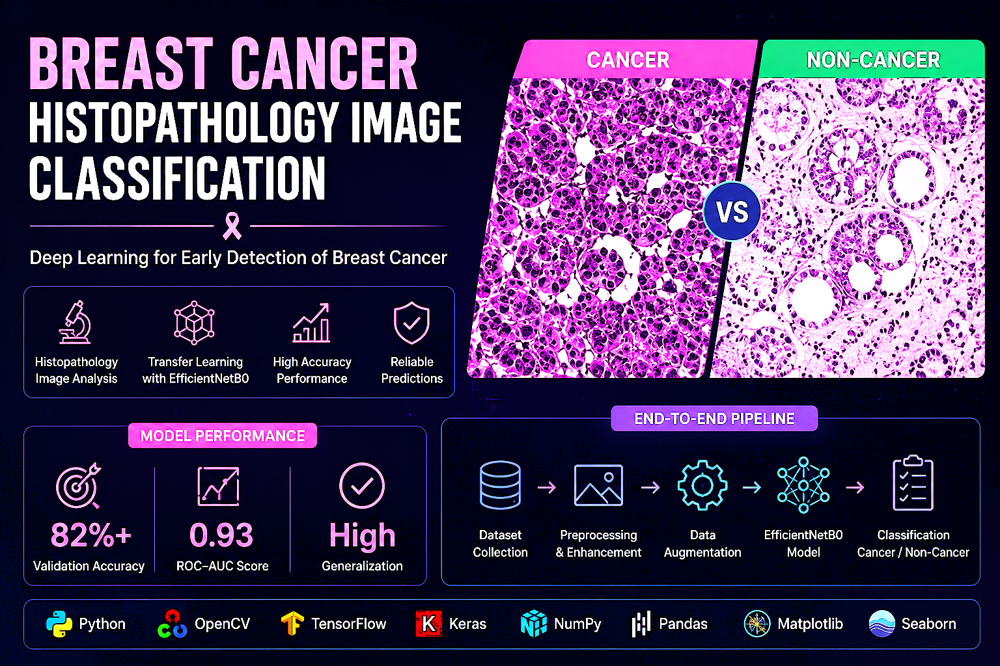
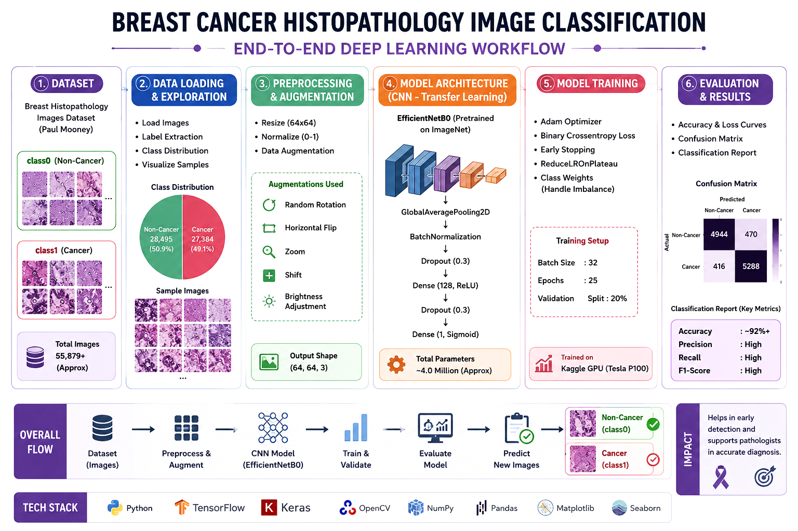

<p align="center">
  
</p>


# 🩺 Breast Cancer Histopathology Image Classification

An end-to-end Deep Learning project for classifying breast histopathology images into **Cancer** and **Non-Cancer** classes using Computer Vision and Convolutional Neural Networks (CNNs).

This project demonstrates how Artificial Intelligence can assist pathologists in the early detection of breast cancer by automatically analyzing microscopic tissue images.

---

## 📌 Project Overview

Breast cancer is one of the most common cancers worldwide. Histopathological examination remains the gold standard for diagnosis. However, manual analysis is time-consuming and requires expert knowledge.

This project aims to automate the classification process using Deep Learning.

### Classification Classes

- **Class 0** → Non-Cancer
- **Class 1** → Cancer

---

## 🚀 Features

✅ Complete Exploratory Data Analysis (EDA)

✅ Histopathology Image Visualization

✅ Image Preprocessing Pipeline

✅ Class Imbalance Handling using Class Weights

✅ Data Augmentation

✅ CNN-based Deep Learning Model

✅ Model Training & Validation

✅ Performance Visualization

✅ Medical Image Classification

---

## 🗂️ Dataset

**Dataset Link:**

https://www.kaggle.com/datasets/paultimothymooney/breast-histopathology-images

### Dataset Information

- Dataset contains histopathology image patches.
- Images are extracted from breast biopsy slides.
- Each image belongs to one of the following classes:

```text
class0 → Non-Cancer
class1 → Cancer
```

Typical image filename:

```text
10295_idx5_x1351_y1101_class0.png
10295_idx5_x1351_y1151_class1.png
```

---

<p align="center">
  
</p>

# 🏗️ Project Workflow

```text
Dataset Collection
        ↓
Data Loading
        ↓
DataFrame Creation
        ↓
Exploratory Data Analysis (EDA)
        ↓
Image Preprocessing
        ↓
Train Validation Test Split
        ↓
Data Augmentation
        ↓
Class Weight Computation
        ↓
CNN Model Building
        ↓
Model Training
        ↓
Model Evaluation
        ↓
Prediction
```

---

# 📊 Exploratory Data Analysis

The notebook includes:

- Dataset Overview
- Class Distribution Analysis
- Count Plot
- Pie Chart
- Random Sample Visualization
- Cancer vs Non-Cancer Comparison
- Image Shape Analysis
- Pixel Statistics

---

# ⚙️ Image Preprocessing

The following preprocessing steps were applied:

- Image Reading
- BGR to RGB Conversion
- Image Resizing
- Normalization
- Data Augmentation

### Image Size

```python
(64, 64, 3)
```

---

# 🔄 Data Augmentation

To improve model generalization and reduce overfitting:

```python
ImageDataGenerator(
    rotation_range=20,
    zoom_range=0.15,
    width_shift_range=0.10,
    height_shift_range=0.10,
    horizontal_flip=True
)
```

### Augmentations Used

- Rotation
- Zoom
- Horizontal Flip
- Width Shift
- Height Shift

---

# ⚖️ Handling Class Imbalance

The dataset is imbalanced.

To address this issue:

- Class Weights were computed.
- Minority class samples received higher importance during training.

This reduces bias toward the majority class and improves cancer detection performance.

---

# 🧠 Model Architecture

```text
Input Layer
      ↓
Conv2D + ReLU
      ↓
BatchNormalization
      ↓
MaxPooling2D
      ↓
Conv2D + ReLU
      ↓
BatchNormalization
      ↓
MaxPooling2D
      ↓
Conv2D + ReLU
      ↓
BatchNormalization
      ↓
MaxPooling2D
      ↓
Flatten
      ↓
Dense Layer
      ↓
Dropout
      ↓
Output Layer (Sigmoid)
```

---

# 🏋️ Model Training

Training Configuration:

```python
Optimizer : Adam
Loss      : Binary Crossentropy
Metric    : Accuracy
Epochs    : 20
Batch Size: 64
```

Additional Techniques:

- Early Stopping
- Class Weights
- Data Augmentation

---

# 📈 Model Evaluation

The model was evaluated using:

- Accuracy
- Loss Curves
- Confusion Matrix
- Classification Report
- Precision
- Recall
- F1 Score
- ROC-AUC Curve

---

# 🛠️ Tech Stack

| Category | Technologies |
|----------|-------------|
| Language | Python |
| Deep Learning | TensorFlow, Keras |
| Computer Vision | OpenCV |
| Data Analysis | NumPy, Pandas |
| Visualization | Matplotlib, Seaborn |
| Environment | Kaggle Notebook |

---

# 📂 Project Structure

```text
├── Breast_Cancer_Classification.ipynb
├── README.md
├── breast_cancer_classifier.keras
├── requirements.txt
└── images/
```

---

# ▶️ How to Run

### Clone Repository

```bash
git clone https://github.com/yourusername/Breast-Cancer-Histopathology-Classification.git
```

### Install Dependencies

```bash
pip install -r requirements.txt
```

### Run Jupyter Notebook

```bash
jupyter notebook
```

Open:

```text
Breast_Cancer_Classification.ipynb
```

---

# 🎯 Future Improvements

- EfficientNetB0 Transfer Learning
- DenseNet121 Implementation
- Model Explainability using Grad-CAM
- Hyperparameter Tuning
- Model Deployment using Streamlit/FastAPI

---

# 👨‍💻 Author

**Kanha Patidar**

- LinkedIn: www.linkedin.com/in/kanha-patidar-837421290
- GitHub: https://github.com/kanha165

---

## ⭐ If you found this project useful, please consider giving it a star!
